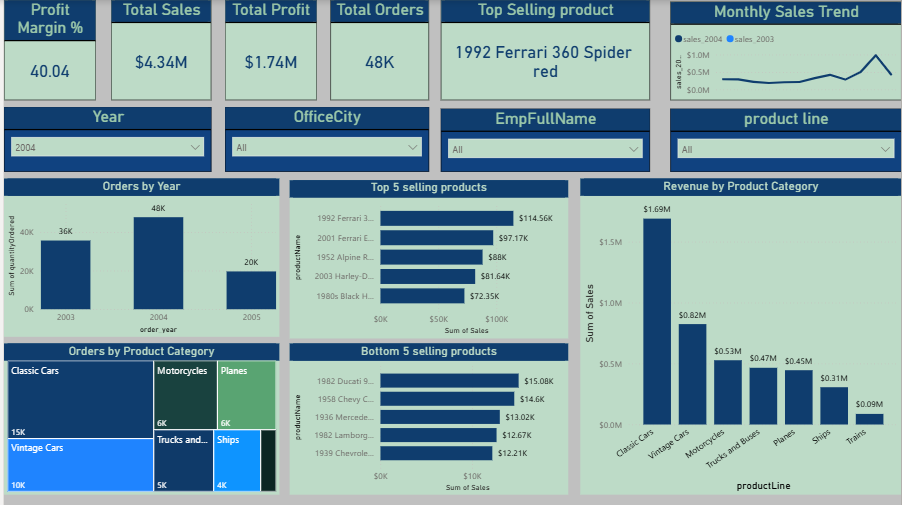

# 📊 Sales Performance Dashboard (Power BI)

## 📌 Overview
This project showcases an interactive Power BI dashboard designed to analyze sales performance across product categories and time periods.  
The goal is to transform raw data into meaningful insights for business decision-making.

---

## 📊 Key Metrics
- Total Sales: $4.34M  
- Total Profit: $1.74M  
- Total Orders: 48K  
- Profit Margin: 40%  

---

## 📈 Key Insights
- Sales peaked in 2004 with the highest number of orders  
- Classic Cars contributed the highest share of total revenue  
- Ferrari 360 Spider is the top-performing product  

---

## 🛠 Tools & Technologies
- Power BI  
- Power Query  
- Data Visualization  

---

## 📷 Dashboard Preview

---

## 🚀 Project Objective
The objective of this project is to analyze sales data and identify trends, high-performing products, and revenue drivers to support data-driven decisions.
